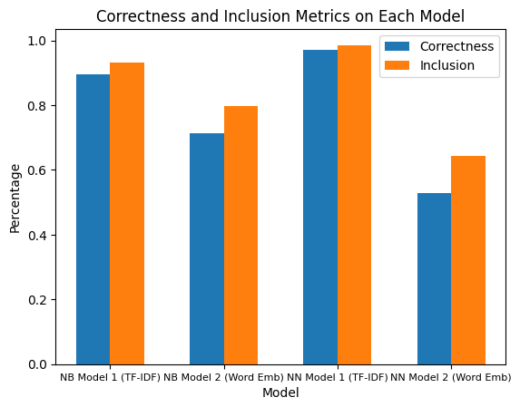

# MedicalAssist

The idea behind this project was to design a system that could take in a description of a 
patient's symptoms and output a list of the top most likely diagnoses. This system could ideally 
help doctors see some diagnoses they may not have considered, or it could help students or 
individuals learn about some possible diagnoses given their situation. It uses a simple neural 
network model to make predictions.

## Web App Technologies
The web app uses React on the frontend and Flask on the backend.

## Data, Metrics, and Models

### Data
For training, the "Symptom2Disease" dataset from Kaggle was used: https://www.kaggle.com/datasets/niyarrbarman/symptom2disease. The dataset contains information on 24 different possible diagnoses.
Before feeding the data into the models, some preprocessing steps were applied.

Preprocessing steps applied to the dataset include:
- Making all labels and descriptions lowercase
- Removing all stopwords using the NLTK library's list of stopwords
- The NLTK library's Snowball Stemmer was applied, converting words into their base form. For example, the words "run", "running" and "ran" may all become "run" using the stemmer.
- Extra characters such as commas, periods, and apostrophes were removed, as they do not provide much extra information for the models

### Metrics
Since we wanted to work with the model's top labels, we decided to make 2 labels for evaluating 
the models:
- Correctness Accuracy: How many times the model assigned the highest probability to the correct label
- Inclusion Accuracy: How many times the model includes the correct label somewhere in its top k labels, in this case we used k = 3

### Models
We tried the following models and word representations to see which would do best:
- Naive Bayes model using a TFIDF word representation
- Naive Bayes model using a word embedding word representation
- Simple Neural Network with TFIDF word representation
- Simple Neural Network with word embedding word representation

The "Simple Neural Network" models used an architecture of 3 linear layers and a ReLU activation
function between each layer. It was built using the Pytorch library.

Ultimately, the neural network using the TFIDF word representation did best and was used in the
final web app. 

